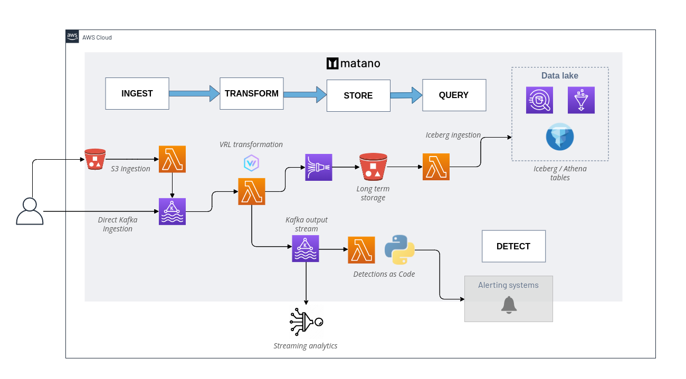

<div align="center">
    <a href="https://www.matano.dev"></a>
    <h3>The open-source security lake platform for AWS.</h3>
</div>

<p align="center">  
        <a href="#"></a>
        <a href="#"></a>
        <br>
        <a href="/LICENSE" target="_blank"></a>
        <!--  -->
 <a href="https://discord.gg/YSYfHMbfZQ" target="_blank"></a>
        <a href="https://twitter.com/intent/follow?screen_name=matanolabs" target="_blank"></a>
</p>

<h3 align="center">
        <a href="https://www.matano.dev">Website</a>
        <span> | </span>
        <a href="https://www.matano.dev/docs">Docs</a>
        <span> | </span>
        <a href="https://discord.gg/YSYfHMbfZQ">Community</a>
</h3>

<div align="center">
   <h3>
     <a href="https://www.matano.dev/blog/2022/08/11/announcing-matano?utm_source=ghr">🔔 Read our announcement blog post 🔔</a>
   </h3>
</div>

## What is Matano?

Matano is an open source security lake platform for AWS. It lets you ingest petabytes of security and log data from various sources, store and query them in an open Apache Iceberg data lake, and create Python detections as code for realtime alerting. Matano is *fully serverless* and designed specifically for AWS and focuses on enabling high scale, low cost, and zero-ops. Matano deploys fully into your AWS account.

<div align="center">
  <br>
  
</div>

## Features

#### Collect data from all your sources
Matano lets you collect log data from sources using [S3](#) or SQS based ingestion.

#### Ingest, transform, normalize log data
Matano normalizes and transforms your data using [Vector Remap Language (VRL)](https://vector.dev/docs/reference/vrl/). Matano works with the [Elastic Common Schema (ECS)](https://www.elastic.co/guide/en/ecs/current/index.html) by default and you can define your own schema. 

#### Store data in S3 object storage
Log data is always stored in S3 object storage, for cost effective, long term, durable storage.

#### Apache Iceberg Data lake
All data is ingested into an Apache Iceberg based data lake, allowing you to perform ACID transactions, time travel, and more on all your log data. Apache Iceberg is an open table format, so you always **own your own data**, with no vendor lock-in.

#### Serverless
Matano is a fully serverless platform, designed for zero-ops and unlimited elastic horizontal scaling.

#### Detections as code
Write Python detections to implement realtime alerting on your log data.

## Installing

[**View the complete installation instructions.**](https://www.matano.dev/docs/installation)

You can install the matano CLI to deploy Matano into your AWS account, and manage your Matano deployment.

### Requirements

- Docker

### Installation

Matano provides [a nightly release](https://github.com/matanolabs/matano/releases/tag/nightly) with the latest prebuilt files to install the Matano CLI on GitHub. You can download and execute these files to install Matano.

For example, to install the Matano CLI for Linux, run:

```bash
curl -OL https://github.com/matanolabs/matano/releases/download/nightly/matano-linux-x64.sh
chmod +x matano-linux-x64.sh
sudo ./matano-linux-x64.sh
```

## Getting started
[**Read the complete docs on getting started**](https://www.matano.dev/docs/getting-started).

### Deployment

To get started with Matano, run the `matano init` command. Make sure you have AWS credentials in your environment (or in an AWS CLI profile).

The interactive CLI wizard will walk you through getting started by generating an initial [Matano directory](https://www.matano.dev/docs/matano-directory) for you, initializing your AWS account, and deploying Matano into your AWS account.

Initial deployment takes a few minutes.

## Documentation

[**View our complete documentation.**](https://www.matano.dev/docs)

## License

* [Apache-2.0 License](LICENSE)


