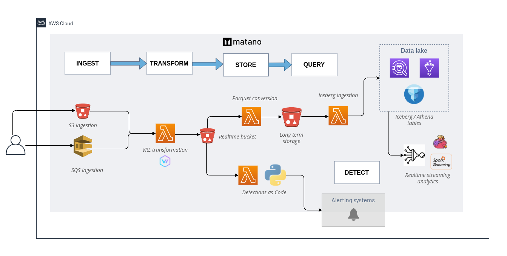
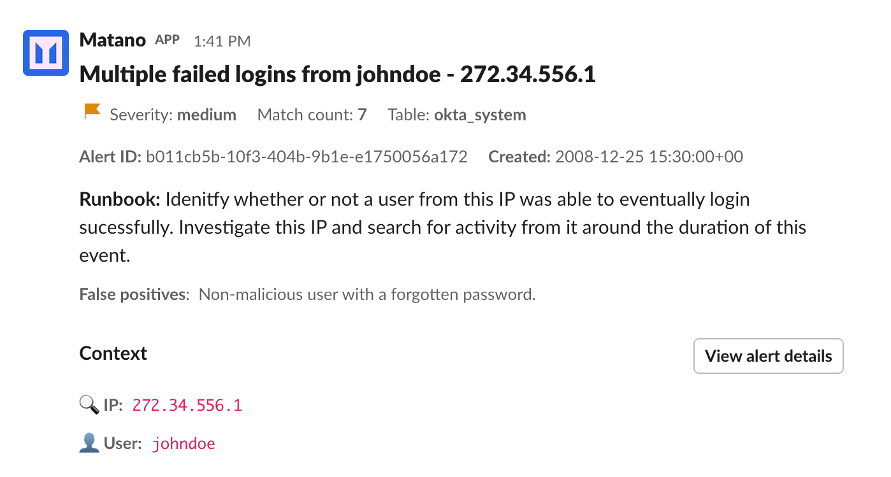

<p align="center">
  <a href="https://www.matano.dev"></a>
</p>

<p align="center">
         <a href="#"></a>
        <a href="#"></a>
         <br/>
<!--  <br>
 <a href="https://github.com/matanolabs/matano/stargazers/" target="_blank"></a> -->
        <!--  -->
 <a href="https://discord.gg/YSYfHMbfZQ" target="_blank"></a>
        <a href="https://twitter.com/intent/follow?screen_name=matanolabs" target="_blank"></a>
                <a href="/LICENSE" target="_blank"></a>
                <a href="https://bestpractices.coreinfrastructure.org/projects/6478"></a>
</p>

## Matano is an open source security lake platform for AWS

<p align="center">
  <strong>
    <a href="https://www.matano.dev/blog/2022/08/11/announcing-matano?utm_source=ghr">🔔 Read our announcement blog post 🔔</a>
  </strong>
</p>

Matano is an open source **cloud-native alternative to SIEM**, built for security teams on AWS.

We are on a mission to build the first open platform for threat hunting, detection & response, and cybersecurity analytics at petabyte scale.

<div>
<h3 align="center">
        <a href="https://www.matano.dev/docs">Docs</a>
        <span> | </span>
        <a href="https://www.matano.dev">Website</a>
        <span> | </span>
        <a href="https://discord.gg/YSYfHMbfZQ">Community</a>
</h3>
</div>

## Features

- **Security Data Lake:** Matano normalizes unstructured security logs into a structured realtime data lake in your AWS account.
- **Collect All Your Logs:** Matano integrates out of the box with [50+ sources](https://www.matano.dev/docs/log-sources/managed-log-sources) for security logs and can easily be extended with custom sources.
- **Detections-as-Code:** Use Python to build realtime detections as code. Support for automatic import of [Sigma](https://www.matano.dev/docs/detections/importing-from-sigma-rules) detections to Matano.
- **Log Transformation Pipeline:** Matano supports custom VRL ([Vector Remap Language](https://vector.dev/docs/reference/vrl/)) scripting to parse, enrich, normalize and transform your logs as they are ingested without managing any servers.
- **No Vendor Lock-In:** Matano uses an open table format ([Apache Iceberg](https://iceberg.apache.org/)) and open schema standards ([ECS](https://github.com/elastic/ecs)), to give you full ownership of your security data in a vendor-neutral format.
- **Bring Your Own Analytics:** Query your security lake directly from any Iceberg-compatible engine (AWS Athena, Snowflake, Spark, Trino etc.) without having to copy data around.
- **Serverless:** Matano is _fully serverless_ and designed specifically for AWS and focuses on enabling high scale, low cost, and zero-ops.

## Architecture

<div align="center">
  <br>
  
</div>

## 👀 Use cases

- Reduce SIEM costs drastically (1/10th the cost).
- Augment your SIEM with a security data lake for additional context during investigations.
- Instantly search for matches to IOCs across your data lake using standardized fields.
- Write detections-as-code using Python to detect suspicious behavior & create contextualized alerts.
- Easier to use cloud-native open source SIEM alternative for detection & response.
- ECS-compatible severless alternative to ELK / Elastic Security stack.

## Quick start

[**View the complete installation instructions**](https://www.matano.dev/docs/installation)

### Installation

Install the matano CLI to deploy Matano into your AWS account, and manage your Matano deployment.

**Linux**

```bash
curl -OL https://github.com/matanolabs/matano/releases/download/nightly/matano-linux-x64.sh
chmod +x matano-linux-x64.sh
sudo ./matano-linux-x64.sh
```

**macOS**

```bash
curl -OL https://github.com/matanolabs/matano/releases/download/nightly/matano-macos-x64.sh
chmod +x matano-macos-x64.sh
sudo ./matano-macos-x64.sh
```

### Deployment

[**Read the complete docs on getting started**](https://www.matano.dev/docs/getting-started)

To get started with Matano, run the `matano init` command.

- Make sure you have AWS credentials in your environment (or in an AWS CLI profile).
- The interactive CLI wizard will walk you through getting started by generating an initial [Matano directory](https://www.matano.dev/docs/matano-directory) for you, initializing your AWS account, and deploying Matano into your AWS account.
- Initial deployment takes a few minutes.

<div align="center">
  
</div>

<br>

### Directory structure

Once initialized, your [Matano directory](https://www.matano.dev/docs/matano-directory) is used to control & manage all resources in your project e.g. log sources, detections, and other configuration. It is structured as follows:

```bash
➜  example-matano-dir git:(main) tree
├── detections
│   └── aws_root_credentials
│       ├── detect.py
│       └── detection.yml
├── log_sources
│   ├── cloudtrail
│   │   ├── log_source.yml
│   │   └── tables
│   │       └── default.yml
│   └── zeek
│       ├── log_source.yml
│       └── tables
│           └── dns.yml
├── matano.config.yml
└── matano.context.json
```

When onboarding a new log source or authoring a detection, run `matano deploy` from anywhere in your project to deploy the changes to your account.

## ✨ Integrations

#### Managed log sources

- [**AWS CloudTrail**](https://www.matano.dev/docs/log-sources/managed-log-sources/cloudtrail)
- [**Office 365**](https://www.matano.dev/docs/log-sources/managed-log-sources/office365)
- [**Suricata**](https://www.matano.dev/docs/log-sources/managed-log-sources/suricata)
- [**Zeek**](https://www.matano.dev/docs/log-sources/managed-log-sources/zeek)
- [**Custom 🔧**](#-log-transformation--data-normalization)

#### Alert destinations

- [**Amazon SNS**](https://www.matano.dev/docs/detections/alerting)
- [**Slack**](https://www.matano.dev/docs/detections/alerting/slack)

#### Enrichment / Threat Intel

- **AbuseCH** ([URLhaus](https://urlhaus.abuse.ch), [MalwareBazaar](https://bazaar.abuse.ch), [ThreatFox](https://threatfox.abuse.ch))
- **MaxMind GeoIP** (_coming soon_)
- **GreyNoise Intelligence** (_coming soon_)
- **Custom 🔧** (_coming soon_)

#### Query engines

- [**Amazon Athena**](https://docs.aws.amazon.com/athena/latest/ug/querying-iceberg.html) (default)
- [**Snowflake**](https://www.snowflake.com/blog/iceberg-tables-powering-open-standards-with-snowflake-innovations/) (preview)
- [**Spark**](https://iceberg.apache.org/spark-quickstart/)
- [**Trino**](https://trino.io/docs/current/connector/iceberg.html)
- [**BigQuery Omni (BigLake)**](https://cloud.google.com/biglake)
- [**Dremio**](https://docs.dremio.com/software/data-formats/apache-iceberg/)

## 🔧 Log Transformation & Data Normalization
[**Read the complete docs on configuring custom log sources**](https://www.matano.dev/docs/log-sources/configuration)

Matano uses [Vector Remap Language (VRL)](https://vector.dev/docs/reference/vrl/), to allow users to easily onboard custom log sources and encourages you to normalize fields according to the [Elastic Common Schema (ECS)]() to enable enhanced pivoting and bulk search for IOCs across your security data lake.

Users can define custom VRL programs to parse and transform unstructured logs as they are being ingested through one of the supported mechanisms for a log source (e.g. S3, SQS).

VRL is an expression-oriented language designed for transforming observability data (e.g. logs) in a safe and performant manner. It features a simple syntax and a rich set of built-in functions tailored specifically to observability use cases.

### Example: parsing JSON

Let's have a look at a simple example. Imagine that you're working with
HTTP log events that look like this:

```json
{
  "line":"{\"status\":200,\"srcIpAddress\":\"1.1.1.1\",\"message\":\"SUCCESS\",\"username\":\"ub40fan4life\"}"
}
```

You want to apply these changes to each event:

- Parse the raw `line` string into JSON, and explode the fields to the top level
- Rename `srcIpAddress` to the `source.ip` ECS field
- Remove the `username` field
- Convert the `message` to lowercase

Adding this VRL program to your log source as a `transform` step would accomplish all of that:

###### log_source.yml
```yml
transform: |
  . = object!(parse_json!(string!(.line)))
  .source.ip = del(.srcIpAddress)
  del(.username)
  .message = downcase(string!(.message))

schema:
  ecs_field_names:
  - source.ip
  - http.status
```

The resulting event 🎉:

```json
{
  "message": "success",
  "status": 200,
  "source": {
    "ip": "1.1.1.1"
  }
}
```

## 📝 Writing Detections

[**Read the complete docs on detections**](https://www.matano.dev/docs/detections)

Use Matano detections to define rules that can alert on threats in your security logs. Matano users define _detections as code_ (DaC). A _detection_ is a Python program that is invoked with data from a log source in realtime and can create an _alert_.

### Examples

#### Detect failed attempts to export AWS EC2 instance in AWS CloudTrail logs.

```python
def detect(record):
  return (
    record.deepget("event.action") == "CreateInstanceExportTask"
    and record.deepget("event.provider") == "ec2.amazonaws.com"
    and record.deepget("event.outcome") == "failure"
  )
```

#### Detect Brute Force Logins by IP across all configured log sources (e.g. Okta, AWS, GWorkspace)

###### detect.py

```python
def detect(r):
    return (
        "authentication" in r.deepget("event.category", [])
        and r.deepget("event.outcome") == "failure"
    )


def title(r):
    return f"Multiple failed logins from {r.deepget('user.full_name')} - {r.deepget('source.ip')}"


def dedupe(r):
    return r.deepget("source.ip")
```

###### detection.yml

```yaml
...
tables:
  - aws_cloudtrail
  - okta_system
  - o365_audit
alert:
  severity: medium
  threshold: 5
  deduplication_window_minutes: 15
  destinations:
    - slack_my_team
```

#### Detect Successful Login from never before seen IP for User

```python
from detection import remotecache

# a cache of user -> ip[]
user_to_ips = remotecache("user_ip")

def detect(record):
    if (
      record.deepget("event.action") == "ConsoleLogin" and
      record.deepget("event.outcome") == "success"
    ):
        # A unique key on the user name
        user = record.deepget("user.name")

        existing_ips = user_to_ips[user] or []
        updated_ips = user_to_ips.add_to_string_set(
          user,
          record.deepget("source.ip")
        )

        # Alert on new IPs
        new_ips = set(updated_ips) - set(existing_ips)
        if existing_ips and new_ips:
            return True
```

## 🚨 Alerting

[**Read the complete docs on alerting**](https://www.matano.dev/docs/detections/alerting)

#### Alerts Matano table

All alerts are automatically stored in a Matano table named `matano_alerts`. The alerts and rule matches are normalized to ECS and contain context about the original event that triggered the rule match, along with the alert and rule data.

**Example Queries**

Summarize alerts in the last week that have breached threshold

```sql
select
  matano.alert.id as alert_id,
  matano.alert.rule.name as rule_name,
  max(matano.alert.title) as title,
  count(*) as match_count,
  min(matano.alert.first_matched_at) as first_matched_at,
  max(ts) as last_matched_at,
  flatten(array_distinct(array_agg(related.ip))) as related_ip,
  flatten(array_distinct(array_agg(related.user))) as related_user,
  flatten(array_distinct(array_agg(related.hosts))) as related_hosts,
  flatten(array_distinct(array_agg(related.hash))) as related_hash
from
  matano_alerts
where
  matano.alert.first_matched_at > (current_timestamp - interval '7' day)
  and matano.alert.breached = true
group by
  matano.alert.rule.name,
  matano.alert.id
order by
  last_matched_at desc
```

#### Delivering alerts

Matano allows you to deliver alerts to external systems. You can use the Matano alerting SNS topic to deliver alerts to Email, Slack, and other services.

<div align="center">
  <br>
  
  <br>
  <i>A medium severity alert delivered to Slack</i>
</div>

## ❔ Why Matano?

- Traditional tools used to analyze security data (SIEMs) don’t scale, and are too expensive and difficult to manage for cloud-based security teams.
- Cybersecurity vendors lock your data in proprietary formats which make it difficult to use outside of their product. With Matano, all your data is in open Apache Iceberg tables that can can be directly queried from different tools (AWS Athena, Snowflake, etc.) without having to copy any data.
- **Security is a Big Data problem**: collecting data from your network, SaaS, and cloud environments can exceed 100TBs of data. Security teams are forced to either not collect some data, leave data unprocessed, or build an in-house data lake to cost-effectively analyze large datasets. Matano helps you easily build a security data lake with all features needed for detection and response.
- At scale, without a strategy to normalize data into a structured format, it is difficult to correlate across data sources & build effective alerts that don’t create many false positives. Traditional SIEM query-based rules fail to accurately identify threats. Matano's detection-as-code approach offers greater flexibility and help's you harden your detections over time.

## ❤️ Community support

For general help on using Matano, please refer to the official Matano [documentation](https://matano.dev/docs). For additional help, feel free to use one of these channels to ask a question:

- [Discord](https://discord.gg/YSYfHMbfZQ) \(Come join the Matano family, and hang out with the team and community\)
- [Forum](https://github.com/matanolabs/matano/discussions) \(For deeper conversations about features, the project, or problems\)
- [GitHub](https://github.com/matanolabs/matano) \(Bug reports, Contributions\)
- [Twitter](https://twitter.com/matanolabs) \(Get news hot off the press\)

## License

- [Apache-2.0 License](LICENSE)


