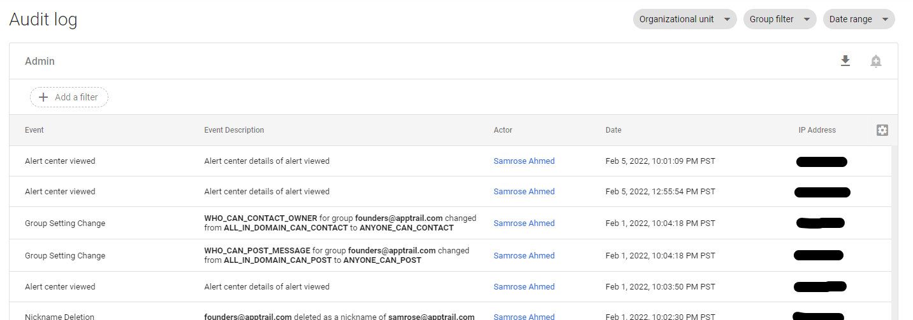
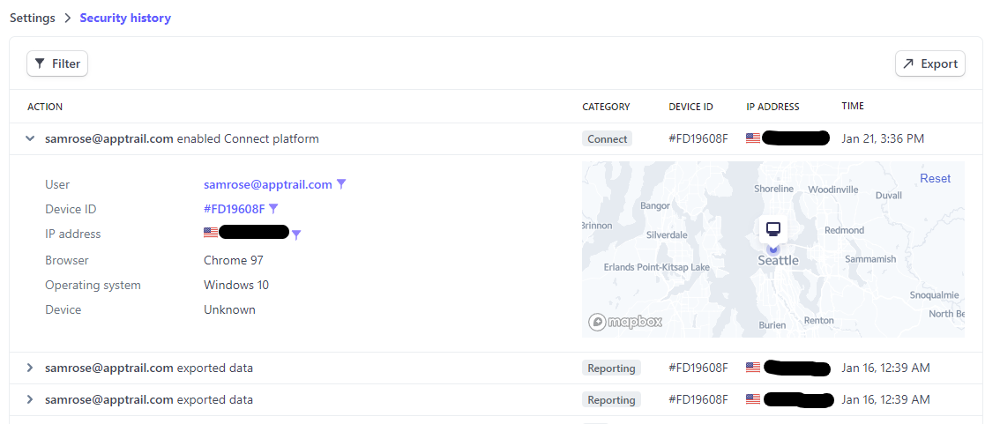

At Apptrail, we obsess over audit trails and how to make them most valuable for our customers, so we thought we'd examine some real world examples of audit trails and see what makes some stand out from others.

<!--truncate-->

There's a lot of details and requirements that go into building an audit trails solution, from availability and immutability to
security and delivery, but, let's examine some of the features that differentiate solutions from one another.

## What's an audit trail anyway?

_If you're already familiar with audit trails, feel free to skip this section._

An audit trail is a way to record user or API activity and surface that information. Generally, an audit trail lets admins or users
answer the _Who_, _When_, _Where_, and _What_ of an action. Audit trails can be used to monitor suspicious activity
or replay activity in the aftermath of an event.

We use _audit trails_, _audit logs_, and _audit events_ here interchangeably.

## Some real world examples

Lets take a whirl through some popular tools that offer audit logs.

### Google Admin

Google Workspace has a mature audit logs offering. Let's see what we can do:

Immediately, we can see all the recent actions that took place with Google workspace.
The information contains the event name, description, time, who did the action (_actor_), and the IP address associated with the actor. The data is filterable and offers a CSV export through the UI. Google offers several types of audit logs, and data retention (how long the data is stored ranges from 6 to 15 months.

Google workspace audit log coverage is [fairly extensive](https://cloud.google.com/logging/docs/audit/gsuite-audit-logging#log-types), with both configuration changes and data access changes audited. Google also offers [an API](https://cloud.google.com/logging/docs/audit/configure-gsuite-audit-logs#api) for accessing audit logs, and also enables [streaming Google Audit logs into Google Cloud](https://cloud.google.com/logging/docs/audit/configure-gsuite-audit-logs#gcloud).

### Stripe

Stripe uses logs in a few places. Let's take a look.

#### Security history

These events contain important actions, and similarly add information about the when, who, and where of the action.
The results are accessible in the Dashboard UI, and exportable to CSV.

#### Request logs

Stripe also offers developer oriented request logs. These are often used for debugging but are also essentially audit logs.

The Stripe request logs contain full request, response, and context data for every HTTP request
made to the API. They're viewable through the Stripe Dashboard UI and filterable on each dimension. Stripe request logs have a
15 month data retention period.

### Github

Github offers a pretty full featured [audit logs solution](https://docs.github.com/en/enterprise-cloud@latest/admin/user-management/managing-organizations-in-your-enterprise/streaming-the-audit-logs-for-organizations-in-your-enterprise-account)
to its Enterprise customers. You can access Github audit logs by 1) using the web UI, 2) polling with the REST API, and 3) streaming to destinations like S3 or Splunk using
their audit log streaming feature.

Streaming audit logs is an important feature that a lot of audit logs solutions lack. It unlocks a lot of usecases, like being able to explore a large amount of data or retaining ownership over data, that a UI or API based approach don't allow.

### AWS CloudTrail

AWS offers audit logs for most of its services using [CloudTrail](https://docs.aws.amazon.com/awscloudtrail/latest/userguide/cloudtrail-user-guide.html). You can query audit logs from the Console UI and using the AWS APIs. You can also deliver AWS audit logs to your S3 bucket or CloudWatch logs group. CloudTrail offers a pretty limited (heavily paginated and throttled) [LookupEvents](https://docs.aws.amazon.com/awscloudtrail/latest/APIReference/API_LookupEvents.html) API to query audit data but in general nudges you towards sending audit logs to S3.

### And more

There's many more software services offering audit logs. For the sake of brevity:

- [Zendesk](https://support.zendesk.com/hc/en-us/articles/4408828001434) offers audit logs through a UI, with filters, CSV export, and a REST query API. Logs
  are retained for 1 year, which is not configurable.
- 1Password offers a UI based [activity log](https://support.1password.com/activity-log/) with viewable and searchable activity including event, actor, and date, but omitting context such as IP. The activity log has a non configurable retention of 6 months.
  Additionally, they offer a more extensive REST [Events API](https://blog.1password.com/introducing-events-api/) for programmatic access and access to more audit events.

## Comparison

That covers a bit about audit trails, how customers use them, and what elements make them most useful to customers. Summarizing our survey:

|                  | Filterable? | Exportable? | API access? | Streaming? | Configurable retention? |
| ---------------- | :---------: | :---------: | :---------: | :--------: | :---------------------: |
| Stripe           |     ✔️      |     ✔️      |     ❌      |     ❌     |           ❌            |
| 1Password        |     ✔️      |     ✔️      |     ✔️      |     ❌     |           ❌            |
| Zendesk          |     ✔️      |     ✔️      |     ✔️      |     ❌     |           ❌            |
| Google Workspace |     ✔️      |     ✔️      |     ✔️      |     ✔️     |           ❌            |
| Github           |     ✔️      |     ✔️      |     ✔️      |     ✔️     |           ✔️            |
| CloudTrail       |     ✔️      |     ✔️      |     ✔️      |     ✔️     |           ✔️            |

We can see audit trails vary on several dimensions:

#### Self service access

Admins being able to access the audit logs themselves, without needing a manual request, is the first step to a customer facing audit trail. At the bare minimum, a web UI to explore audit
logs should be provided.

#### Exportability

Viewing audit logs in a UI is good for one off usecases, but users often want to export the data for analysis with other tools.

#### Programmatic API access

Users want to be able to interact with their data programatically, for scripting, workflows, etc. The API should allow for querying events by time and filtering on fields. These APIs are generally paginated and throttled, as there is an unbounded number of audit logs.

#### Audit log streaming

When there's a large amount of audit logs, a poll based API is not sufficient, and users will want to have their data pushed into tools like S3 or Splunk, or other SIEM's or data analysis tools, for analysis.

#### Data retention

Audit logs must be immutable to protect their integrity, but they are usually retained for a period of time, ranging from months to years. Ideally, this should be configurable by the user. Adding audit log streaming also automatically enables this, as it gives the customer ownership of their audit data (essentially unlimited retention).

## Conclusion

That was a short overview of some popular tools and how they offer audit trails to their customers.
We can see there are a range of different features that go into an audit logs solution, and software
providers vary in what they currently offer.

Do you have any examples of great audit logs? Feel free to share.
