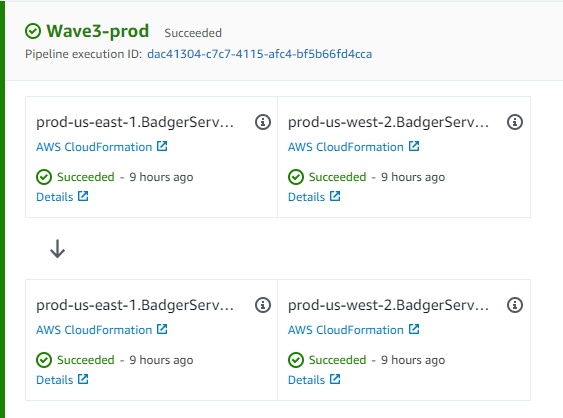

import { Mermaid } from "mdx-mermaid/Mermaid";

At least for me, building on the cloud gives often gives me unexpected joy. To think that I can deploy servers in Bahrain or Japan from my couch is still something I get excited about!

At Apptrail, we run completely on the cloud, specifically AWS, and one of the main reasons is how easy it is to launch services in new geographical regions. We deploy our services to independent cloud regions and provide our customers with regional endpoints (e.g. `events.us-west-2.apptrail.com`).

Here are some of our learnings from building a fully regional service on AWS.

<!--truncate-->

## What are cloud regions?

Cloud providers have a concept of regions for their cloud. These are isolated geographical regions where their physical infrastructure is hosted and where they offer cloud services. For example, at the time of this article, AWS offers 26 different cloud regions. Software applications built on the cloud can leverage cloud regions to also build a concept of regions in their applications to improve their services.

### Cellular architecture

To understand regionality, it's good to understand _cellular architecture_. Cellular (or cell-based) architecture is a way of separating systems into isolated _cells_ to reduce the blast radius from something going wrong. The idea is that a failure shouldn't ever cross cells, and so cellularization is a way of creating those independent partitions. The actual method of choosing a cell can be anything, from random based on ID to logical like geographical region. You can also have nested cells for further isolation (e.g. _Large volume customers in US West region_ could be a particular cell). AWS Availability zones, for example, are also sub-regional cells. All in all, cellularization is a very powerful way of designing available systems, you can [learn more about it here](https://www.youtube.com/watch?v=swQbA4zub20).

### Why regions exist

Regions, then, are just cells that are based on geographical region. Regions serve several purposes. From an availability and reliability perspective, regions are at the center of a cloud's reliability strategy. In a cellular architecture, regions serve as the first and most principal cells. They ensure that there is a logical containment of resources that are isolated from others. This helps prevent widespread outages.

Regions do refer to actual geographic regions, so this is also an important part of why they exist. One benefit of this is latency. Providing a way for customers to ensure that their workloads run in a particular region helps them with running workloads close to their customers.

Another important usecase is compliance and data sovereignty. Many countries are passing legislation requiring user data and other sensitive data to be physically stored in locations under their jurisdiction. Cloud regions are a way to ensure compliance with such regulations.

## Multi region architectures

Because cloud providers do the hard work of making sure all their services are available in isolated regions, one benefit customers get is being able to run multi region workloads. Multi region architecture is a way to get another layer of reliability beyond multi availability zone. You can, for example, run a load balanced service across multiple regions using Route 53 for latency based routing and health check based failover. One can also use regions for data preservation and backup, e.g. with Amazon S3. Region wide outages are pretty rare at AWS so active multi region for services is likely overkill (as it may also come with downsides like cross region data transfer), but everyone has their availability requirements and multi region architectures are a powerful tool to leverage for increased availability.

## Regionalized architectures

A regionalized architecture is one where the regionality is part of the interface of the service. For example, in regional architectures, one has dedicated regional endpoints that clients use for each supported region. Each regional service in a regional architecture should be independent of other instances running in other regions.

As an example, say we have an image processing API. Our clients use this API to upload, process, and retrieve videos. To regionalize this API, we can deploy the API to multiple regions and offer endpoints like `region1.videoapi.example.com` and `region2.videoapi.example.com` for our clients to use.

#### Difference between multi region and regionalized architectures

_Comparison between regional (left) and multi region architectures_

The key difference between multi region and regionalized architectures is that in regional architectures, the region is part of the contract of the service, whereas in multi region architectures it is solely part of the implementation. In a multi region architecture, regions are used as cells for increased availability or as a failover. There is no guarantee that a specific customer's requests will run in a specific region. Rather, the customer doesn't even have to know about the concept of region vis-à-vis the service. In a regional architecture, however, the region is part of the public API, and customers choose or are informed of the region they are associated with.

### Choosing regions for a regional architecture

When building a regionalized architecture, one needs to pick a list of geographical regions to support and a methodology to assign them. You're likely deployed on a cloud, so a simple decision is to choose your regions to correspond to cloud regions. This is [what we do at Apptrail](https://apptrail.com/docs/applications/guide/regions), for example. One can rename them, or just use the same names, which is what we do at Apptrail ourselves.

However, a one-to-one mapping is not necessary. You can also come up with regions that correspond to multiple cloud regions. For example, a region structure could look as follows:

| Region |          AWS Region(s)          |
| :----: | :-----------------------------: |
|   us   | us-east-1, us-west-2, us-east-2 |
|   eu   |      eu-west-1, eu-west-2       |
|   jp   | ap-northeast-1, ap-northeast-2  |
|   in   |     ap-south-1, ap-south-2      |

_Regionalization scheme using multi region cells_

Such a scheme gives one some benefit of each application region consisting of multiple cloud regions, which can improve availability.

## When to use a regional architecture

Most services likely don't need to be fully regionalized. Unlike multi-regionality, which is solely a technical engineering decision, choosing to regionalize your public APIs or services is more so a product decision. It should generally serve some need or purpose for your customer. We observe common usecases:

#### Data residency requirements

Regionalization of your services is a way of allowing your customers to ensure their data is stored and processed in a specific region. This is often requested due to regulatory reasons.

#### Latency

For other applications, minimizing client latency is highly important. Keeping requests in the region closest to a customer is a way to achieve this. However, as keeping requests in region is not inherently a strict requirement, complete regionalization may or may not be the correct approach here, as a single endpoint with latency based routing may also fulfill the requirements. The desired experience of the customer is important to consider here (e.g. do you want your customer to have to think of regions?).

## Choosing components to regionalize

When evaluating a regional architecture, a natural question is what components to regionalize. Specifically, which services to have a publicly regional interface for. There are several considerations here, and the answer goes back to why one is using a regional architecture in the first place. A useful heuristic we use is one between _control planes_ and _data planes_. Generally, control plane services shouldn't be regional, but dataplane services can be. To understand why, we may consider the common actions we do in the control plane: e.g. billing, user management, or other global configuration. These often have single region dependencies and are relatively infrequent. For us, it's neither important nor desirable to have these be regionalized. On the other hand, our data plane processes that process and store important data are regionalized.

Note that while this is a general guideline that we ourselves have found useful, it's in no way prescriptive. There are many cases where one may make the control plane regionalized as well. In general, the reason for regionalization should be central to this decision. One should consider how regionalizing a service will help or prevent them from achieving that goal.

## How we deploy to many regions

Infrastructure and deployment automation is key to being able to maintain consistency, reliability, and understandability while deploying many services across different regions. Thankfully, infrastructure as code solutions, particularly the AWS CDK, make this much easier.

### Staged deployment using Waves

We use a concept of _waves_ when deploying software at Apptrail. Going back to cellular architecture, a wave is essentially a set of cells to deploy to concurrently. For example, currently, our waves are:

|  Wave  |   Apptrail Regions   |
| :----: | :------------------: |
| Wave 1 |      ap-south-1      |
| Wave 2 |      eu-west-1       |
| Wave 3 | us-west-2, us-east-1 |

_Our current waves at Apptrail_

Deploying to one wave at a time ensures that faulty changes don't cause global outages. Combined with bake times (adding wait times between waves to monitor for degradation) and automated rollbacks, waves can help ensure that you don't have catastrophic failures. We've found them to be very useful for staging our changes. You can [learn more about waves here](https://aws.amazon.com/builders-library/automating-safe-hands-off-deployments/).

### Infrastructure as Code - CDK

Completely automating your infrastructure is essential when deploying to many regions since one is duplicating one's entire application and services each time they deploy to a new region. We use the AWS CDK to help us do this. CDK is a wrapper around CloudFormation that lets you write your infrastructure as real code (e.g. we use Typescript). It makes building reusable abstractions (called _constructs_) as easy as writing a class or a function ([Learn more about it here](https://docs.aws.amazon.com/cdk/v2/guide/home.html), we think it's one of the coolest things AWS offers!).

The CDK also comes with useful high level abstractions out of the box, so you don't have to reinvent the wheel.

_A pipeline deploying one of our regional services to one of our waves_

For example, we use [CDK Pipelines](https://aws.amazon.com/blogs/developer/cdk-pipelines-continuous-delivery-for-aws-cdk-applications) for deploying all of our infrastructure at Apptrail. In CDK Pipelines, stages and _waves_ are supported natively so you can easily deploy cellular applications. At Apptrail, we've developed a standard _Pipeline_ construct that sets up our standard waves and makes creating a regionalized service conforming to Apptrail regions and waves very simple.

## Other considerations around regional architectures

Here are some other things we've learned building regional applications on AWS.

#### Use separate AWS accounts per region

This is general AWS best practice but reinforces thinking of each instance of a service deployed in a region as separate with clearly delineated blast radiuses.

#### Managing cost

Regionalization inherently comes with some additional cost. However, when an application is architected correctly, the additional cost due to regionalization should mainly be a fixed cost per region, which is generally negligible at scale. Regionalized services shouldn't generally have excessive have cross-region data transfer (databases and other global data is often the exception, but this should be low cost).

#### Global data

A common consideration when evaluating a regionalized or multi region architecture is what to do with global data. There's no one answer here. Keeping in mind our earlier discussion on choosing components to regionalize and data planes & control planes, there are several ways we could deal with this. For example, we could keep global data in one control plane region, and our regionalized data plane services can depend on this control plane. This is what we use ourselves at Apptrail. However, this may or may not be acceptable. If latency is the primary motivation for regionalization, then this is less than ideal. There are several ways to deal with this, including DynamoDB Global Tables and database replication, that are beyond the scope of this article (see this [video](https://www.youtube.com/watch?v=2e29I3dA8o4) for some more information). On the other hand, if the main reason for regionalization is data residency, and our control plane only stores non-sensitive configuration, then this is a more fitting approach.

## Conclusion

As it gets easier and easier to deploy to the cloud, and with increased concern about data sovereignty, regional architectures are becoming more common. This gave you an overview of how we easily maintain our regional services on AWS at Apptrail. You might not need regionalization for your next project, but I hope this was helpful and informative.

_What do you think of regionalization, do you use it in your applications? Feel free to reply._
