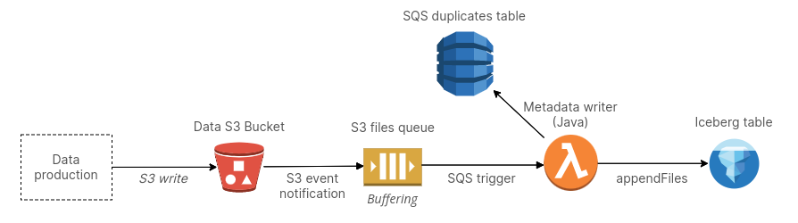

import coverImg from "./cover.png";

<meta property="og:image" content={coverImg}/>

Matano relies on Apache Iceberg as its main data lake and store. To ingest data into Matano Iceberg tables, we rely on a unique design that keeps the system both realtime and serverless.

<!-- truncate -->

<figure align="center">
    
</figure>

## Background

Apache Iceberg is an open data format for large datasets. It lets you query data stored in object storage from a variety of compute engines. Feel free to learn about it [here](https://iceberg.apache.org).

Internally, Iceberg works by maintaining metadata files to track your table's data. For example, every time data is inserted or deleted, Iceberg does record keeping and stores files to track these changes. Thus, if you have a system that generates data and want to query the data using an Apache Iceberg table, you need to ensure the files are also appended to Iceberg. In a realtime/streaming scenario, committing Iceberg metadata alongside data is not often desirable or feasible, as it will result in many concurrent commits and many small metadata files. If you are writing data directly using an engine like Apache Flink, for example, then this is handled for you, through some sort of buffering. However, using such an engine may not be possible for a variety of reasons; e.g. you're ingesting data produced by an external system or you're in an environment not conducive to running an engine like Flink (e.g., in our case, a Lambda function).

We can design a system where we decouple data writing from Iceberg metadata ingestion. This is a good fit for realtime streaming systems. See, for example, [LinkedIn's FastIngest system using Gobblin][1]. We additionally needed the system to be completely serverless, and so couldn't rely on a host based buffering model.

## Design to ingest data into Iceberg

To summarize, we need a system that:

1. Lets us write data independent of Iceberg. For example, we can use a managed service like Firehose to write the Parquet data files or write them ourselves from a Lambda function.
2. Ingest the data files into Iceberg in *realtime*. Thus, we don't want a batch based approach.
3. Be completely serverless. We don't want a system that e.g. relies on long running compute or an in memory/on disk buffer.

The design works as follows. First, we write data files directly to S3. Next, we configure an S3 event notification on this bucket. The S3 event notification is sent to an SQS queue. We add a Lambda function trigger to this SQS queue. The Lambda function, using the Java Apache Iceberg library, calls Iceberg APIs (namely `appendFiles`) and ingests the files that were written to S3 into Apache Iceberg.



### Concurrent commits

There's several considerations here. First, we need to ensure we are not making too many concurrent commits to an Iceberg table. In short, each time we append files to an Iceberg table, that creates a commit, and you cannot have a high number of concurrent commits to a single table because Iceberg needs to maintain atomicity by locking the table. Therefore, in a streaming scenario, we need to introduce some sort of buffering. As a durable queue, SQS can be used as a buffer for ingesting our files into Iceberg tables. You can set a batch size and window that is both realtime and ensures you aren't creating commits too often. In general, there is always a tradeoff with latency of data ingestion but one can experiment to set a satisfactory buffering rate.

### Handling duplicate messages

If you're an astute observer, you may have noticed that our inclusion of SQS in our design introduced the possibility of duplicate messages, as SQS only guarantees at least once delivery. In this scenario, this would mean that we would accidentally incorrectly ingest the same file twice into Iceberg. We can handle this with a DynamoDB table to track duplicates. Each S3 event notification includes a `sequencer` key that is unique per file. We can use a DynamoDB condition expression before committing each file to Iceberg to ensure we aren't processing a duplicate.

## Implementation

Let's dig a bit deeper into a how we'd actually implement this. These examples are simplified, see a full example with imports [on GitHub][2].

```kotlin
class IcebergMetadataWriter {
    // In a real world usecase, you can create this dynamically from the data.
    val icebergTable: Table = icebergCatalog.loadTable(TableIdentifier.of(Namespace.of(NAMESPACE), TABLE_NAME))
    val appendFiles: AppendFiles = icebergTable.newAppend()

    // Lambda handler
    fun handle(sqsEvent: SQSEvent) {
        for (record in sqsEvent.records) {
            processRecord(record, tableObjs)
        }
        appendFiles.commit()
    }
}
```
We have a Lambda handler processing an SQS event. We create a new appendFiles for Iceberg. We then process each record in the event and (remember, we receive multiple files to commit based on our batch size) and append a file for each record and then we commit the entire appendFiles.

Let's look at the how we process each record:

```kotlin
fun processRecord(sqsMessage: SQSMessage): Unit {
    val record = S3EventNotification.parseJson(sqsMessage.body).records[0]
    val s3Bucket = record.s3.bucket.name
    val s3Object = record.s3.`object`
    val s3ObjectKey = s3Object.key
    val s3ObjectSize = s3Object.sizeAsLong
    val s3Path = "s3://$s3Bucket/$s3ObjectKey"

    if (checkDuplicate(s3Object.sequencer)) {
        println("Found duplicate SQS message for key: ${s3ObjectKey}. Skipping...")
        return
    }

    val metrics = readParquetMetrics(s3Path, icebergTable)
    val partition = PartitionSpec.builderFor(icebergTable.schema()).day(TIMESTAMP_COLUMN_NAME).build()
    val dataFile = DataFiles.builder(partition)
            .withPath(s3Path)
            .withFileSizeInBytes(s3ObjectSize)
            .withFormat("PARQUET")
            .withMetrics(metrics)
            .build()
    appendFiles.appendFile(dataFile)
}
```

There's a few things going on here. For each SQS record (which represents an S3 file) we're appending a file to the Iceberg table. In addition to the path of the S3 File, we also provide to Iceberg the file size, which was conveniently included in the S3 event notification, as well as metrics, which are used by Iceberg for querying. To retreive the metrics from our Parquet files, we'll need to make a network call, but it will read just the footer, where the metrics are stored. Here's the implementation:

```kotlin
fun readParquetMetrics(s3Path: String, table: Table): Metrics {
    return ParquetUtil.fileMetrics(fileIO.newInputFile(s3Path), MetricsConfig.forTable(table))
}
```

Lastly, we need to implement checking for duplicates. We use a DynamoDB table and do a conditional PutItem to ensure we aren't processing a duplicate. Our code looks as follows:

```kotlin
fun checkDuplicate(sequencer: String): Boolean {
    // TTL to expire old DynamoDB items
    val expireTime = ((System.currentTimeMillis() / 1000L) + DDB_ITEM_EXPIRE_SECONDS).toString()
    val attrs = mapOf(
            "sequencer" to AttributeValue(sequencer),
            "ttl" to AttributeValue().apply { this.setN(expireTime) }
    )
    val req = PutItemRequest(DUPLICATES_DDB_TABLE_NAME, attrs)
            .apply { this.conditionExpression = "attribute_not_exists(sequencer)" }

    try { ddb.putItem(req) }
    catch (e: ConditionalCheckFailedException) {
        return true
    }
    return false
}
```

## Conclusion

And that's how we do Iceberg ingestion in Matano. We think its a lightweight and useful pattern for ingesting data into Iceberg tables. Feel free to use and adapt it in your systems. You can also view a real world implementation inside the [Matano GitHub repo][2].

<p style={{fontSize:"20px"}}>

*Interested in how we use Iceberg to build the open source security lake platform for AWS? Check out [**Matano on GitHub**](https://github.com/matanolabs/matano) and give us a star.*

</p>

[1]: https://engineering.linkedin.com/blog/2021/fastingest-low-latency-gobblin
[2]: https://github.com/matanolabs/matano/blob/main/lib/java/matano/iceberg_metadata/src/main/kotlin/com/matano/iceberg/IcebergMetadataWriter.kt
